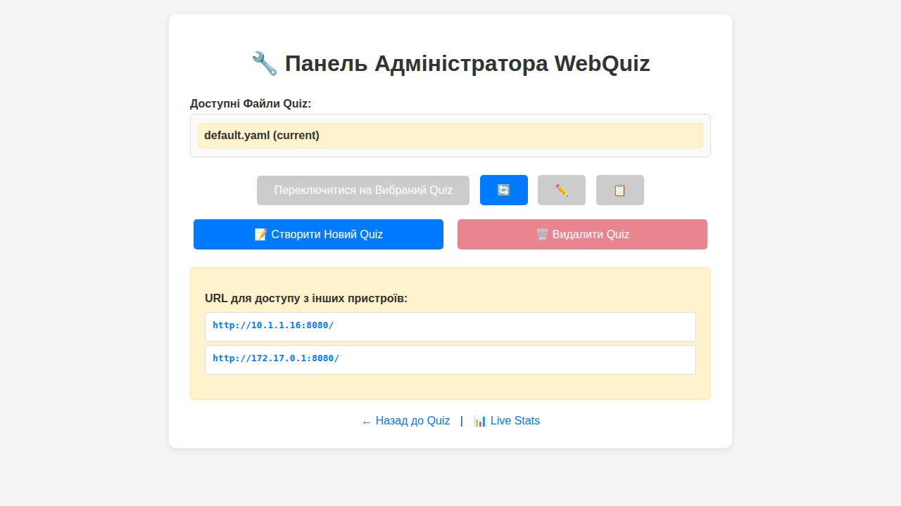
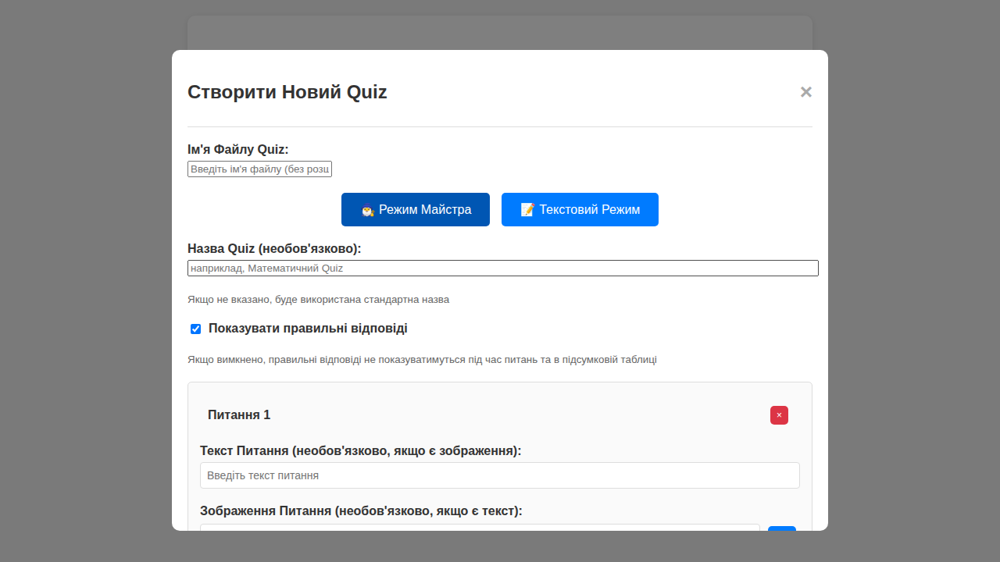

# Адміністративний Інтерфейс WebQuiz

Цей документ надає детальний опис адміністративної панелі WebQuiz з повним описом функцій, можливостей та інструкціями з використання.

## Доступ до Адмін-Панелі

### Активація Адміністративного Режиму

Для доступу до адміністративних функцій необхідно запустити сервер з ключем адміністратора:

```bash
# Запуск з ключем адміністратора
webquiz --master-key your_secret_key

# Або через змінну середовища
export WEBQUIZ_MASTER_KEY="your_secret_key"
webquiz
```

### URL Адрес
- **Адмін-панель**: `http://localhost:8080/admin`
- **Основний інтерфейс**: `http://localhost:8080/`
- **Живі статистики**: `http://localhost:8080/live-stats`

## Інтерфейс Входу



### Форма Аутентифікації

1. **Перехід до адмін-панелі**: Відкрийте `http://localhost:8080/admin`
2. **Введення ключа**: У полі "Master Key" введіть ключ адміністратора
3. **Вхід в систему**: Натисніть кнопку "Увійти"


## Головна Панель Адміністратора

### Загальна Інформація
- **Назва поточного тесту**: Відображається вгорі сторінки
- **Кількість питань**: Показує загальну кількість питань у активному тесті
- **Статус сервера**: Індикатор стану роботи системи

### Розділи Інтерфейсу

#### 1. Керування Тестами

**Доступні тести:**


**Функції:**
- **Перегляд списку тестів**: Всі YAML файли з папки `quizzes/`
- **Перемикання тестів**: Клік по назві тесту для активації
- **Інформація про тест**: Кількість питань та поточний статус

#### 2. Створення Нових Тестів

**Кнопка "Створити новий тест":**
```
┌─────────────────────────────────────┐
│ ➕ Створити новий тест              │
└─────────────────────────────────────┘
```

**Режими створення:**
1. **Візуальний редактор** (рекомендовано)
2. **Текстовий редактор** (для досвідчених користувачів)

### Візуальний Редактор Тестів



#### Налаштування Тесту


#### Додавання Питань

Візуальний редактор дозволяє:
- **Додавання зображень до питань**: Опціональне завантаження ілюстрацій
- **Варіанти відповідей**: Додавання та редагування варіантів з позначкою правильного
- **Множинні правильні відповіді**: Підтримка питань з кількома правильними варіантами

#### Додаткові Функції

Редактор підтримує основні налаштування для створення тестів з текстовими питаннями та варіантами відповідей.

### Текстовий Редактор

#### YAML Редактор
```yaml
# Приклад структури тесту
title: "Назва вашого тесту"
show_right_answer: true

questions:
  - question: "Ваше питання тут?"
    image: "optional_image.jpg"
    options:
      - "Варіант відповіді 1"
      - "Варіант відповіді 2" 
      - "Варіант відповіді 3"
      - "Варіант відповіді 4"
    correct_answer: 1  # Індекс правильної відповіді (0-3)
    
  - question: "Питання з множинними відповідями"
    options:
      - "Варіант A"
      - "Варіант B"
      - "Варіант C"
      - "Варіант D"
    correct_answer: [0, 2]  # Множинні правильні відповіді
    min_correct_answers: 1  # Мінімальна кількість правильних
```

### Текстовий Редактор

Адміністративна панель також підтримує текстовий режим для прямого редагування YAML файлів тестів.

#### YAML Редактор

Приклад структури тесту:
```yaml
# Приклад структури тесту
title: "Назва вашого тесту"
show_right_answer: true

questions:
  - question: "Ваше питання тут?"
    image: "optional_image.jpg"
    options:
      - "Варіант відповіді 1"
      - "Варіант відповіді 2" 
      - "Варіант відповіді 3"
      - "Варіант відповіді 4"
    correct_answer: 1  # Індекс правильної відповіді (0-3)
    
  - question: "Питання з множинними відповідями"
    options:
      - "Варіант A"
      - "Варіант B"
      - "Варіант C"
      - "Варіант D"
    correct_answer: [0, 2]  # Множинні правильні відповіді
    min_correct_answers: 1  # Мінімальна кількість правильних
```

## Мережеві Налаштування


Адміністративна панель показує доступні URL-адреси для підключення з різних пристроїв:
- **Локальний доступ**: для тестування на тому ж комп'ютері
- **Мережевий доступ**: для підключення з інших пристроїв у мережі

## Живий Моніторинг


WebQuiz надає окрему сторінку для моніторингу активності користувачів у реальному часі:
- **Доступ**: `http://localhost:8080/live-stats/`
- **Функції**: Відстеження прогресу користувачів, часу відповідей, правильності відповідей
- **Оновлення**: Автоматичне оновлення через WebSocket-з'єднання

## Поширені Операції

### Швидкі Дії

#### 1. Створити тест за 5 хвилин - Детальна процедура

**Крок 1: Доступ до адміністративної панелі**


1. Відкрийте адміністративну панель за адресою `http://localhost:8080/admin/`
2. Переконайтеся, що ви автентифіковані (показано "Авто-автентифікація з довіреного IP")
3. Знайдіть кнопку "📝 Створити Новий Quiz" у розділі управління тестами

**Крок 2: Запуск майстра створення тесту**

1. Натисніть кнопку "📝 Створити Новий Quiz"
2. Відкриється модальне вікно створення нового тесту
3. Введіть ім'я файлу для вашого тесту (без розширення .yaml)

**Крок 3: Вибір режиму редагування**


1. Оберіть "🧙‍♂️ Режим Майстра" для візуального редактора (рекомендовано)
2. Альтернативно можете обрати "📝 Текстовий Режим" для прямого редагування YAML

**Крок 4: Налаштування основних параметрів тесту**
1. **Назва тесту**: Введіть описову назву (наприклад, "Математичний Quiz")
2. **Показувати правильні відповіді**: Залиште прапорець встановленим для навчального режиму
3. Ці налаштування будуть збережені у YAML файлі

**Крок 5: Додавання питань**
1. **Перше питання** вже додано автоматично
2. **Введіть текст питання** у відповідне поле
3. **Додайте варіанти відповідей**:
   - Мінімум 2 варіанти, рекомендовано 4
   - Кожен варіант у окремому полі
4. **Позначте правильну відповідь** радіо-кнопкою
5. **Додайте більше питань** натиснувши "➕ Додати Питання"

**Крок 6: Збереження та активація**
1. Натисніть "💾 Зберегти Quiz" після додавання всіх питань
2. Тест буде збережений у папку `quizzes/` з вказаним ім'ям файлу
3. Система автоматично поверне вас до головної панелі
4. Новий тест з'явиться у списку доступних тестів

**Загальний час:** 3-5 хвилин для створення тесту з 3-5 питаннями.

#### 2. Перемкнути тест - Покрокова процедура

**Крок 1: Перегляд доступних тестів**


1. У розділі "Доступні Файли Quiz" перегляньте всі наявні тести
2. Поточний активний тест позначений як "(current)"
3. Кожен тест показує основну інформацію про кількість питань

**Крок 2: Вибір нового тесту**
1. **Клікніть на назву тесту** у списку, який хочете активувати
2. Назва тесту стане виділеною (вибраною)
3. Кнопка "Переключитися на Вибраний Quiz" стане активною

**Крок 3: Підтвердження перемикання**
1. Натисніть кнопку "Переключитися на Вибраний Quiz"
2. **ВАЖЛИВО**: Система покаже попередження про те, що всі поточні користувачі будуть відключені
3. Підтвердьте дію, якщо ви готові перервати поточні сесії

**Крок 4: Верифікація перемикання**
1. Після перемикання обраний тест стане позначений як "(current)"
2. Система скине всі поточні сесії користувачів
3. Створиться новий CSV файл для збереження відповідей
4. Всі наступні користувачі бачитимуть питання з нового тесту

**Час виконання:** 30-60 секунд

#### 3. Моніторинг в реальному часі - Детальна процедура

**Крок 1: Доступ до живої статистики**


1. **З адміністративної панелі**: Натисніть посилання "📊 Live Stats"
2. **Прямий доступ**: Перейдіть на `http://localhost:8080/live-stats/`
3. **Альтернативний доступ**: Введіть `/live-stats/` у адресній стрічці після основної URL

**Крок 2: Розуміння інтерфейсу статистики**
1. **Заголовок показує**:
   - Поточний активний тест (наприклад, "default.yaml")
   - Загальну кількість питань у тесті
   - Кількість активних користувачів

2. **Легенда кольорів**:
   - 🟡 Thinking (Думає) - користувач читає питання
   - 🟢 Correct (Правильно) - дав правильну відповідь
   - 🔴 Incorrect (Неправильно) - дав неправильну відповідь
   - ⚪ Not Started (Не почав) - ще не відповідав на це питання

**Крок 3: Аналіз прогресу користувачів**
1. **Таблиця користувачів показує**:
   - Ім'я користувача у першій колонці
   - Стан відповіді на кожне питання з кольоровими індикаторами
   - Час, витрачений на кожну відповідь (наприклад, "28s")

2. **Відстеження активності**:
   - Оновлення відбувається автоматично через WebSocket
   - Немає потреби оновлювати сторінку
   - Зміни відображаються миттєво

**Крок 4: Використання даних для прийняття рішень**
1. **Ідентифікація проблемних питань**: Якщо багато користувачів дають неправильні відповіді
2. **Моніторинг часу**: Виявлення занадто складних питань за тривалим часом відповіді
3. **Допомога користувачам**: Виявлення користувачів, які "застрягли" на певному питанні

**Час моніторингу:** Постійний, оновлення в реальному часі

### Кращі Практики
- **Тестуйте питання** перед запуском
- **Створюйте резервні копії** регулярно
- **Моніторьте продуктивність** під час тесту
- **Аналізуйте результати** після завершення

## Усунення Проблем

### Часті Проблеми
- **Не можу увійти**: Перевірте правильність master key
- **Тест не перемикається**: Переконайтеся у правильності YAML формату
- **Зображення не завантажуються**: Перевірте розмір та формат файлів
- **Повільна робота**: Моніторьте кількість активних користувачів

### Діагностика
```bash
# Перевірка логів
tail -f logs/server_*.log

# Тестування API
curl -X POST http://localhost:8080/api/admin/auth \
  -H "X-Master-Key: your_key"
```

Адміністративна панель WebQuiz надає потужні інструменти для повного управління системою тестування з інтуїтивним інтерфейсом та широкими можливостями налаштування.