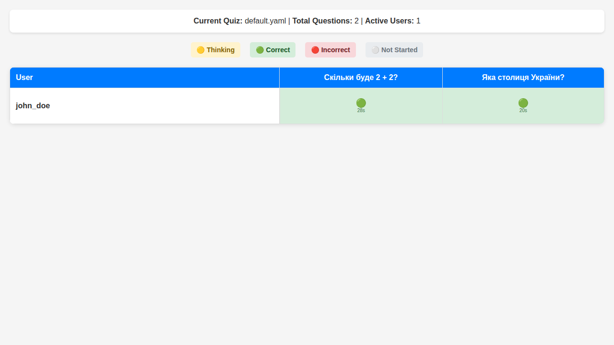

# Адміністративний Інтерфейс WebQuiz

Цей документ надає детальний опис адміністративної панелі WebQuiz з повним описом функцій, можливостей та інструкціями з використання.

## Доступ до Адмін-Панелі

### Активація Адміністративного Режиму

Для доступу до адміністративних функцій необхідно запустити сервер з ключем адміністратора:

```bash
# Запуск з ключем адміністратора
webquiz --master-key your_secret_key

# Або через змінну середовища
export WEBQUIZ_MASTER_KEY="your_secret_key"
webquiz
```

### URL Адрес
- **Адмін-панель**: `http://localhost:8080/admin`
- **Основний інтерфейс**: `http://localhost:8080/`
- **Живі статистики**: `http://localhost:8080/live-stats`

## Інтерфейс Входу


### Форма Аутентифікації

1. **Перехід до адмін-панелі**: Відкрийте `http://localhost:8080/admin`
2. **Введення ключа**: У полі "Master Key" введіть ключ адміністратора
3. **Вхід в систему**: Натисніть кнопку "Увійти"


## Головна Панель Адміністратора

### Загальна Інформація
- **Назва поточного тесту**: Відображається вгорі сторінки
- **Кількість питань**: Показує загальну кількість питань у активному тесті
- **Статус сервера**: Індикатор стану роботи системи

### Розділи Інтерфейсу

#### 1. Керування Тестами

**Доступні тести:**


**Функції:**
- **Перегляд списку тестів**: Всі YAML файли з папки `quizzes/`
- **Перемикання тестів**: Клік по назві тесту для активації
- **Інформація про тест**: Кількість питань та поточний статус

#### 2. Створення Нових Тестів

**Кнопка "Створити новий тест":**
```
┌─────────────────────────────────────┐
│ ➕ Створити новий тест              │
└─────────────────────────────────────┘
```

**Режими створення:**
1. **Візуальний редактор** (рекомендовано)
2. **Текстовий редактор** (для досвідчених користувачів)

### Візуальний Редактор Тестів


#### Налаштування Тесту


#### Додавання Питань

Візуальний редактор дозволяє:
- **Додавання зображень до питань**: Опціональне завантаження ілюстрацій
- **Варіанти відповідей**: Додавання та редагування варіантів з позначкою правильного
- **Множинні правильні відповіді**: Підтримка питань з кількома правильними варіантами

#### Додаткові Функції

Редактор підтримує основні налаштування для створення тестів з текстовими питаннями та варіантами відповідей.

### Текстовий Редактор

#### YAML Редактор
```yaml
# Приклад структури тесту
title: "Назва вашого тесту"
show_right_answer: true

questions:
  - question: "Ваше питання тут?"
    image: "optional_image.jpg"
    options:
      - "Варіант відповіді 1"
      - "Варіант відповіді 2" 
      - "Варіант відповіді 3"
      - "Варіант відповіді 4"
    correct_answer: 1  # Індекс правильної відповіді (0-3)
    
  - question: "Питання з множинними відповідями"
    options:
      - "Варіант A"
      - "Варіант B"
      - "Варіант C"
      - "Варіант D"
    correct_answer: [0, 2]  # Множинні правильні відповіді
    min_correct_answers: 1  # Мінімальна кількість правильних
```

### Текстовий Редактор

Адміністративна панель також підтримує текстовий режим для прямого редагування YAML файлів тестів.

#### YAML Редактор

Приклад структури тесту:
```yaml
# Приклад структури тесту
title: "Назва вашого тесту"
show_right_answer: true

questions:
  - question: "Ваше питання тут?"
    image: "optional_image.jpg"
    options:
      - "Варіант відповіді 1"
      - "Варіант відповіді 2" 
      - "Варіант відповіді 3"
      - "Варіант відповіді 4"
    correct_answer: 1  # Індекс правильної відповіді (0-3)
    
  - question: "Питання з множинними відповідями"
    options:
      - "Варіант A"
      - "Варіант B"
      - "Варіант C"
      - "Варіант D"
    correct_answer: [0, 2]  # Множинні правильні відповіді
    min_correct_answers: 1  # Мінімальна кількість правильних
```

## Мережеві Налаштування


Адміністративна панель показує доступні URL-адреси для підключення з різних пристроїв:
- **Локальний доступ**: для тестування на тому ж комп'ютері
- **Мережевий доступ**: для підключення з інших пристроїв у мережі

## Живий Моніторинг



WebQuiz надає окрему сторінку для моніторингу активності користувачів у реальному часі:
- **Доступ**: `http://localhost:8080/live-stats/`
- **Функції**: Відстеження прогресу користувачів, часу відповідей, правильності відповідей
- **Оновлення**: Автоматичне оновлення через WebSocket-з'єднання

## Поширені Операції

### Швидкі Дії
1. **Створити тест за 5 хвилин**:
   - Натисніть "Створити новий тест"
   - Оберіть "Візуальний редактор"
   - Додайте 3-5 питань
   - Збережіть та активуйте

2. **Перемкнути тест**:
   - Виберіть тест зі списку
   - Підтвердьте перемикання
   - Всі користувачі будуть відключені

3. **Моніторинг в реальному часі**:
   - Відкрийте "Живі статистики"
   - Слідкуйте за прогресом учасників
   - Аналізуйте складні питання

### Кращі Практики
- **Тестуйте питання** перед запуском
- **Створюйте резервні копії** регулярно
- **Моніторьте продуктивність** під час тесту
- **Аналізуйте результати** після завершення

## Усунення Проблем

### Часті Проблеми
- **Не можу увійти**: Перевірте правильність master key
- **Тест не перемикається**: Переконайтеся у правильності YAML формату
- **Зображення не завантажуються**: Перевірте розмір та формат файлів
- **Повільна робота**: Моніторьте кількість активних користувачів

### Діагностика
```bash
# Перевірка логів
tail -f logs/server_*.log

# Тестування API
curl -X POST http://localhost:8080/api/admin/auth \
  -H "X-Master-Key: your_key"
```

Адміністративна панель WebQuiz надає потужні інструменти для повного управління системою тестування з інтуїтивним інтерфейсом та широкими можливостями налаштування.