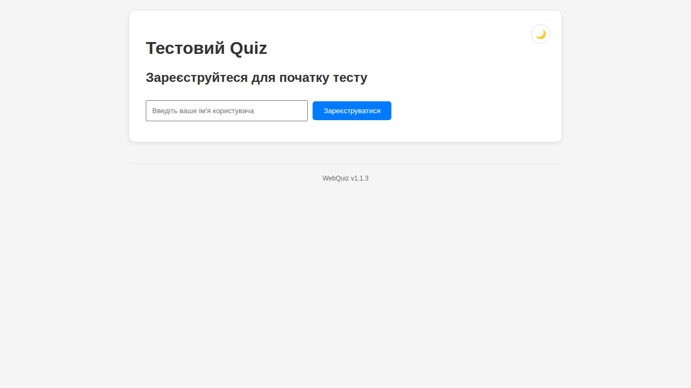
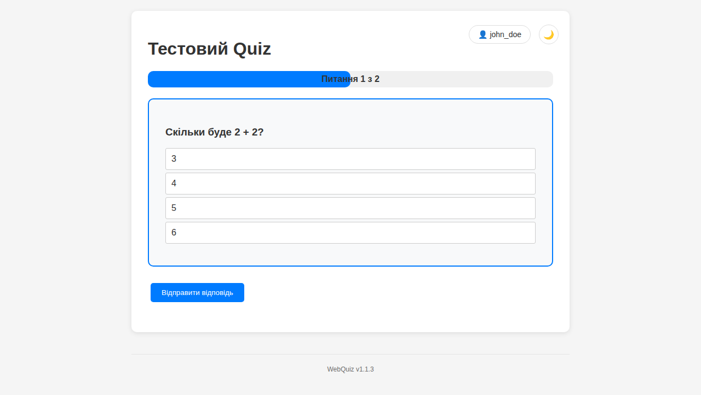
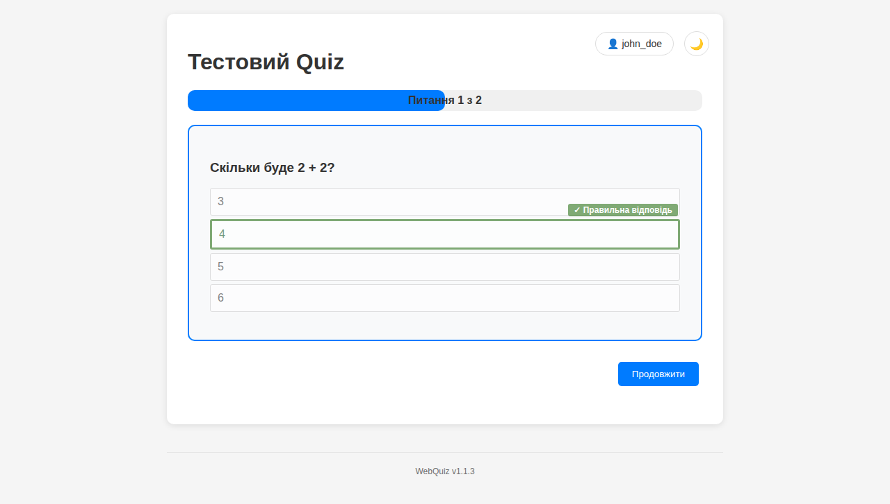
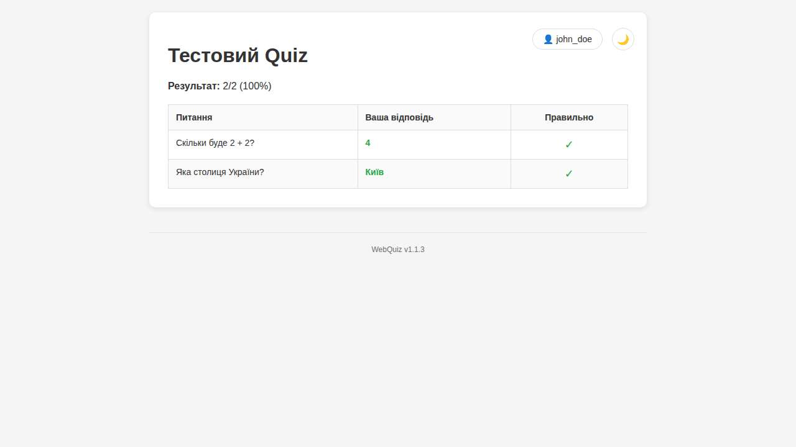
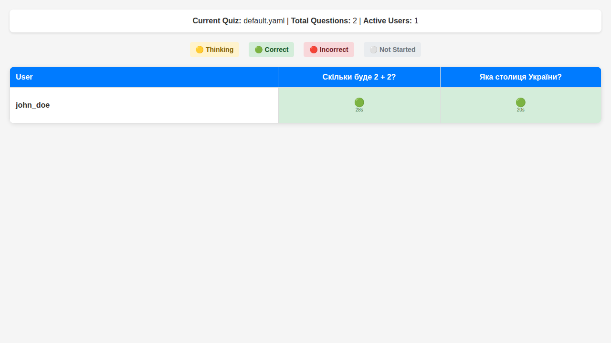

# Посібник користувача WebQuiz

Цей посібник допоможе вам розпочати роботу з системою WebQuiz та ефективно використовувати всі її можливості.

## Швидкий старт

### Запуск системи

```bash
# Базовий запуск
webquiz

# Запуск з адмін-панеллю
webquiz --master-key your_admin_key

# Запуск на іншому порту
webquiz --port 9090
```

Після запуску відкрийте браузер та перейдіть за адресою: `http://localhost:8080`

## Інтерфейс для учасників тесту

### Реєстрація користувача



1. **Відкрийте головну сторінку** - у браузері перейдіть на `http://localhost:8080`
2. **Введіть ім'я користувача** - використовуйте унікальне ім'я (латинські літери, цифри, підкреслення)
3. **Натисніть "Зареєструватися"** - система створить для вас унікальний ідентифікатор

### Проходження тесту



1. **Читання питань** - уважно прочитайте питання та всі варіанти відповідей
2. **Вибір відповіді** - клікніть на варіант, який вважаєте правильним
3. **Подання відповіді** - натисніть кнопку "Відправити відповідь"



4. **Отримання зворотного зв'язку** - побачите зелений/червоний індикатор правильності
5. **Перехід до наступного питання** - натисніть "Продовжити"

### Результати тесту



### Типи питань

#### Звичайні питання
```
Питання: Скільки буде 2 + 2?
○ 3
○ 4  ← правильна відповідь
○ 5
○ 6
```

#### Питання із зображеннями
```
[Зображення карти України]
Питання: Яка столиця України?
○ Харків
○ Львів
○ Київ  ← правильна відповідь
○ Одеса
```

#### Питання з множинними відповідями
```
Питання: Які з цих чисел є парними?
☑ 2  ← правильна
☐ 3
☑ 4  ← правильна
☐ 5
```

### Прогрес та результати

- **Індикатор прогресу** - показує, скільки питань пройдено
- **Таймер** - відслідковує час на кожне питання
- **Фінальні результати** - кількість правильних відповідей та загальний час

## Панель адміністратора

Для доступу до адміністративних функцій необхідно запустити сервер з ключем адміністратора.

### Доступ до адмін-панелі

1. Запустіть сервер: `webquiz --master-key your_secret_key`
2. Перейдіть на: `http://localhost:8080/admin`
3. Введіть ключ адміністратора
4. Натисніть "Увійти"

### Функції адміністратора

#### Керування тестами

**Переглянути доступні тести:**
- Список всіх YAML файлів у папці `quizzes/`
- Поточний активний тест
- Кількість питань у кожному тесті

**Перемкнути тест:**
1. Виберіть тест зі списку
2. Натисніть "Перемкнути на цей тест"
3. Підтвердьте дію (всі поточні користувачі будуть відключені)

**Створити новий тест:**
1. Натисніть "Створити новий тест"
2. Оберіть режим: Візуальний редактор або Текстовий режим
3. Заповніть дані тесту
4. Збережіть файл

#### Візуальний редактор тестів

**Додавання питань:**
1. Натисніть "Додати питання"
2. Введіть текст питання
3. Додайте варіанти відповідей
4. Оберіть правильну відповідь
5. За бажанням додайте зображення

**Налаштування тесту:**
- Назва тесту
- Показувати правильні відповіді після помилок
- Мінімальна кількість правильних відповідей (для множинних питань)

#### Текстовий редактор

Прямий доступ до редагування YAML файлу:

```yaml
title: "Мій тест"
show_right_answer: true

questions:
  - question: "Ваше питання?"
    options:
      - "Варіант 1"
      - "Варіант 2"
      - "Варіант 3"
    correct_answer: 1
```

#### Мережеві налаштування

**Доступ з інших пристроїв:**
- Адмін-панель показує всі доступні IP адреси
- Учасники можуть підключатися з мобільних пристроїв
- QR-коди для швидкого доступу

## Живий моніторинг

### Панель статистики



Доступ: `http://localhost:8080/live-stats`

**Відслідковується:**
- Кількість активних користувачів
- Прогрес кожного користувача
- Час відповіді на питання
- Правильність відповідей у реальному часі

**Оновлення:**
- Автоматичне оновлення через WebSocket
- Без необхідності перезавантажувати сторінку
- Миттєві оновлення при зміні даних

## Аналіз результатів

### CSV файли

Результати зберігаються у папці `csv_data/` з такою структурою:

```csv
user_id,username,question_text,selected_answer_text,correct_answer_text,is_correct,time_taken_seconds
uuid-123,john_doe,"Питання 1","Відповідь B","Відповідь B",true,5.23
uuid-123,john_doe,"Питання 2","Відповідь A","Відповідь C",false,12.45
```

### Аналіз даних

**Excel/LibreOffice:**
1. Відкрийте CSV файл
2. Створіть зведені таблиці
3. Побудуйте графіки результатів

**Python/Pandas:**
```python
import pandas as pd

# Завантажити дані
df = pd.read_csv('csv_data/default_user_responses_0001.csv')

# Статистика по користувачах
user_stats = df.groupby('username').agg({
    'is_correct': ['count', 'sum', 'mean'],
    'time_taken_seconds': ['mean', 'sum']
})

# Складність питань
question_stats = df.groupby('question_text').agg({
    'is_correct': 'mean',
    'time_taken_seconds': 'mean'
})
```

## Кращі практики

### Для організаторів тесту

1. **Підготовка:**
   - Протестуйте всі питання перед проведенням
   - Переконайтеся в стабільності мережі
   - Підготуйте резервний план

2. **Під час тесту:**
   - Моніторьте живу статистику
   - Будьте готові допомогти учасникам
   - Слідкуйте за логами на предмет помилок

3. **Після тесту:**
   - Зробіть резервну копію CSV файлів
   - Проаналізуйте результати
   - Зберіть зворотний зв'язок від учасників

### Для учасників

1. **Технічна підготовка:**
   - Використовуйте сучасний браузер
   - Перевірте інтернет-з'єднання
   - Закрийте непотрібні програми

2. **Під час тесту:**
   - Уважно читайте питання
   - Не поспішайте з відповідями
   - При технічних проблемах повідомте організатора

## Налагодження проблем

### Поширені проблеми

**Не можу зареєструватися:**
- Перевірте унікальність імені користувача
- Переконайтеся, що ім'я містить тільки дозволені символи
- Спробуйте оновити сторінку

**Питання не завантажуються:**
- Перевірте підключення до інтернету
- Оновіть сторінку браузера
- Перевірте, чи працює сервер

**Адмін-панель недоступна:**
- Переконайтеся, що сервер запущений з `--master-key`
- Перевірите правильність ключа
- Спробуйте очистити кеш браузера

### Логи та діагностика

```bash
# Перегляд логів сервера
tail -f logs/server_*.log

# Перевірка стану сервера
curl http://localhost:8080/api/health

# Тестування API
curl -X POST http://localhost:8080/api/register \
  -H "Content-Type: application/json" \
  -d '{"username": "test_user"}'
```

## Розширені можливості

### Кастомізація

**CSS стилі:**
- Змінюйте файли у папці `static/`
- Додавайте власні стилі
- Налаштовуйте кольори та шрифти

**JavaScript функції:**
- Розширюйте функціональність клієнта
- Додавайте власні обробники подій
- Інтегруйте з зовнішніми системами

### API інтеграція

Система надає REST API для інтеграції з іншими системами:

```bash
# Реєстрація користувача
POST /api/register
{"username": "user_name"}

# Подання відповіді
POST /api/submit-answer
{
  "user_id": "uuid",
  "question_id": 1,
  "selected_answer": 2
}

# Отримання прогресу
GET /api/verify-user/{user_id}
```

## Підтримка та допомога

- **Документація:** [configuration.md](configuration.md)
- **Встановлення:** [installation.md](installation.md)
- **Адмін-панель:** [admin-interface.md](admin-interface.md)
- **Репозиторій:** https://github.com/oduvan/webquiz
- **Проблеми:** https://github.com/oduvan/webquiz/issues