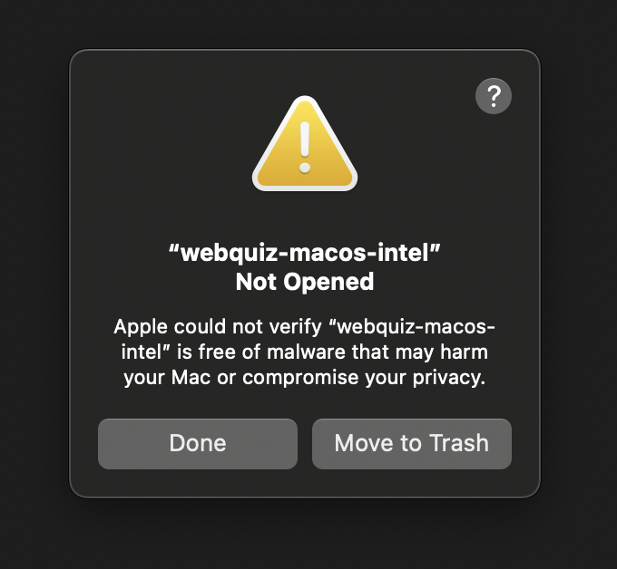
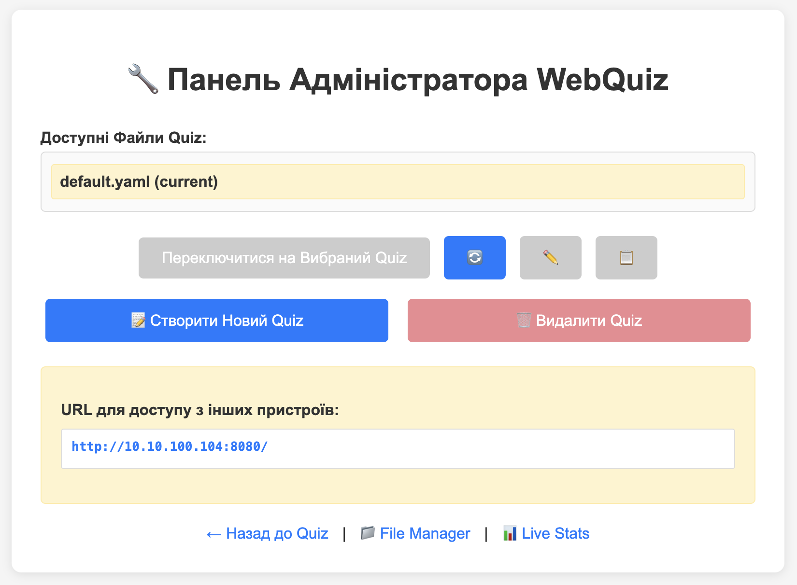
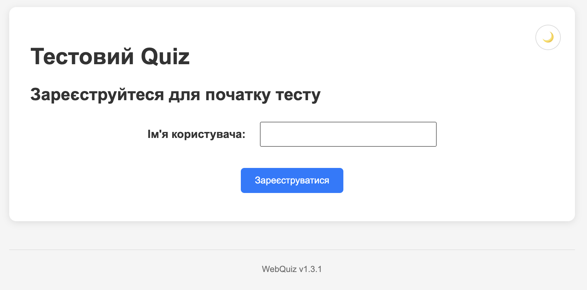

## First Run

This section will help you quickly launch **WebQuiz** in a local network.
The system is designed to work **inside your own network**, so you should not open its port to the public internet. This ensures that quiz results remain private and accessible only to users connected to your local environment.

---

### Download and Launch

The easiest way to start using **WebQuiz** is by running the prebuilt binary file.

1. Go to the [Releases](https://github.com/oduvan/webquiz/releases) page on the project’s GitHub repository.
2. Download the binary file that matches your operating system (Windows, macOS, or Linux).
3. If the file comes as an archive, extract it into any folder you prefer.
4. Run the file:
   - **Windows:** double-click `webquiz.exe` or run it from the command line.
   - **macOS / Linux:** first grant execution permission:
     ```
     chmod +x webquiz
     ```
     then start it:
     ```
     ./webquiz
     ```

#### Important for macOS Users

On first launch on macOS, you'll see a security warning because the binary is not signed by Apple:



To allow the application to run:

1. Click **Done** in the warning dialog
2. Open **System Settings** → **Privacy & Security**
3. Scroll to the **Security** section and click **Open Anyway**:


4. Confirm by clicking **Open Anyway** in the dialog:


WebQuiz will now launch normally. This is a one-time procedure — subsequent launches won't require confirmation.

#### Important for Windows Users

Windows Defender or other antivirus software may flag the binary file as a potential threat. **This is normal behavior for applications created with PyInstaller** — it's a well-known false-positive issue ([details on GitHub](https://github.com/pyinstaller/pyinstaller/issues/6754)).

This is **not a virus**. WebQuiz is safe, open-source software. You can:
- Review the source code on [GitHub](https://github.com/oduvan/webquiz)
- Add the file to Windows Defender exclusions
- Use the alternative Python installation method (`pip install webquiz`)

If you see a warning, allow the application to run or add it to your antivirus's trusted applications list.

---

5. After launching, the admin panel page will open in your terminal at [http://localhost:8080/admin/](http://localhost:8080/admin/):



---

### Files and Folders Created

After the first launch, WebQuiz will automatically create several service files and folders in the same directory as the executable.
They are used to store configuration, results, and diagnostic information.

| File / Folder | Purpose |
|---------------|----------|
| **config.yaml** | The main configuration file. Stores system parameters, including user registration settings, test format, and general options. |
| **quizzes/** | Directory for storing quizzes in YAML format. You can create your own question files or edit the default example that comes included. |
| **results/** | Quiz results in CSV format will be stored here. They can be viewed or opened in spreadsheet editors. |
| **logs/** | Directory containing application logs. Records messages about launches, errors, or warnings. If something goes wrong during testing, these files will help identify the cause. |
| **static/** | Contains the web interface that users see. Typically, you don't need to edit these files. |

---

### The First Quiz

Right after the first run, WebQuiz automatically creates a simple example quiz.
This allows you to immediately test the system without any additional configuration.

To take the quiz:

1. Open [http://localhost:8080](http://localhost:8080) in your browser.



2. Enter your name (or any test name if you're just checking functionality).
3. Click the **Register** button — the system will load the example quiz from the configuration file, and you can complete it like a normal user.
4. After finishing the quiz, open the **results** folder — you'll find a file with the results in CSV format. If needed, also check the **logs** folder to ensure the server is running without errors.


---

### Alternative Launch and Configuration Methods

If you want to configure WebQuiz more flexibly or integrate it into your own scripts, additional launch methods are available:

- **Run via Python:**
  ```
  pip install webquiz
  python -m webquiz
  ```

- **Run via Poetry (for developers):**
  ```
  git clone https://github.com/oduvan/webquiz.git
  cd webquiz
  poetry install
  webquiz
  ```

- **Additional command-line options:**
  - `--config` — specify a custom configuration file path.
  - `--csv-file` — define a custom location for saving results.
  - `--log-file` — change the path of the log file.
  - `-d` or `--daemon` — run the server in background mode.
  - `--stop`, `--status` — stop or check the status of the server.

These capabilities will come in handy if you want to use WebQuiz as part of a larger system or automatically start it when your device boots.
