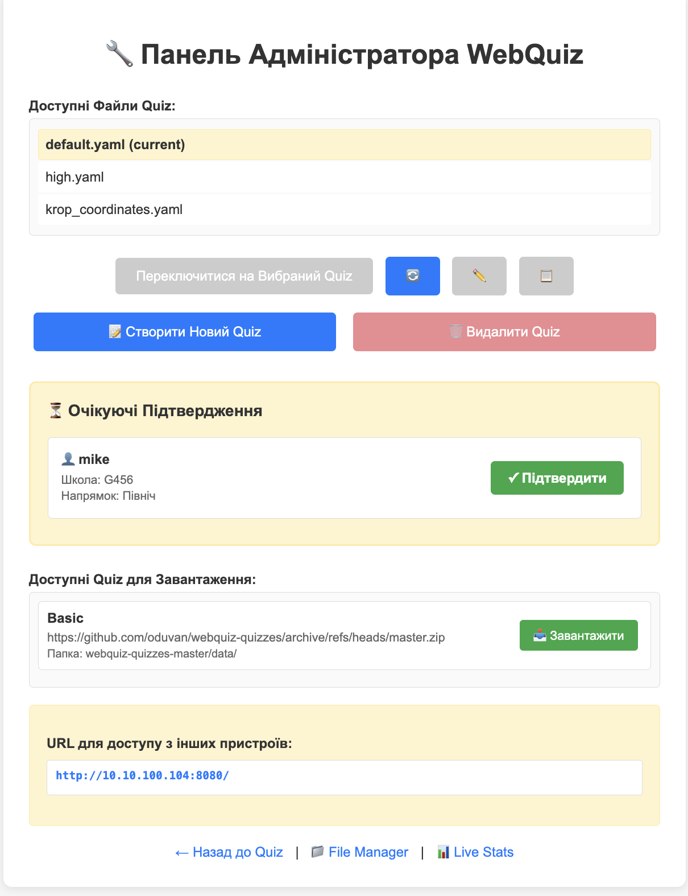

## WebQuiz Administrative Interface

The **WebQuiz** administrative interface allows you to manage quizzes, view results, approve user requests, and work with files directly through the browser.
Access to the panel opens automatically if you connect from a local address (`127.0.0.1` or `localhost`), or using a **Master Key** if connecting from another device on the network.

---

### Main Admin Panel

The main administrative panel page contains essential tools for managing quizzes, approving users, and downloading additional question sets.

#### Main Panel Elements

- **Available Quiz Files**
  The top of the page displays a list of all quizzes available in the `quizzes` folder.
  Each quiz shows its filename and title (if set), for example: `default.yaml - My Quiz Title`.
  The current active quiz is highlighted with a yellow background and marked as **(current)**.

  You can select multiple quizzes using **Ctrl+click** (or **Cmd+click** on macOS) for individual selection, or **Shift+click** to select a range. When multiple quizzes are selected, you can unite them into a single quiz or delete them together.

  You can switch between quizzes or create new ones.

- **"Create New Quiz" Button**
  Opens the interface for creating a new quiz in visual mode.
  The new file will be added to the `quizzes` directory.

- **"Delete Quiz" Button**
  Allows you to delete the selected quiz from the file system.

- **Pending Approvals**
  This panel appears if manual user approval is enabled in the configuration (`registration.approve: true`, see [Configuration](040_config.md) for details).
  It displays a list of users who have registered but are waiting for approval to start the quiz.
  Each user shows their name and registration time. Click the **"Approve"** button to allow them to begin.
  The quiz timer starts only after approval, ensuring fair timing for all participants.

- **Answer Management**
  This section appears only for quizzes with `show_answers_on_completion: true` enabled (see "Quiz File Format" section for details about this option).

  Allows the administrator to force open correct answers for all students without waiting for everyone to complete the test.

  **When this is useful:**
  - Most students have completed the test, but 2-3 students are lagging
  - You don't want to wait for stragglers and are ready to show answers to everyone

  **How it works:**
  1. Click the **"Show Answers for All"** button
  2. Confirm the action in the dialog box
  3. All students (including those who haven't finished yet) will see the correct answers after completing the test
  4. New students who register later will also see the answers

  > ⚠️ **Important:** This is a one-way action — it can only be undone by restarting the quiz or switching to another test.

- **Available Quizzes for Download**
  This section appears only if the `quizzes` section is configured in `webquiz.yaml` (see [Configuration](040_config.md) for details).
  It shows quizzes available for download from external sources (e.g., GitHub repositories).
  The **"Download"** button automatically downloads the archive and extracts it to the `quizzes` folder.

- **URL for Access from Other Devices**
  At the bottom of the panel, links are displayed that other participants can use to connect to the quiz.
  This includes the local network address (e.g., `http://192.168.1.100:8080/`).
  When an SSH tunnel is connected, an external URL is also shown with a green background.

- **SSH Tunnel**
  This section appears only if the `tunnel` section is configured in `webquiz.yaml` (see [Configuration](040_config.md) for details).
  It allows you to expose your local quiz server to the internet via SSH reverse tunnel.
  - **Server** — displays the tunnel server hostname
  - **Public Key** — your SSH public key that needs to be registered on the tunnel server. Use the **Copy** button to copy it to the clipboard.
  - **Connect/Disconnect** — click to establish or terminate the tunnel connection

  When connected, a public URL appears in the "URL for Access from Other Devices" section with a green background, allowing participants outside your local network to join the quiz.

- **Theme Switcher**
  In the top-right corner of the page, there's a button to toggle between light and dark themes. The preference is saved in your browser and applies to all WebQuiz pages.

---

### File Manager

The File Manager is accessed via the **File Manager** link at the bottom of the admin panel.
It allows you to quickly view, download, edit, and diagnose files created by the server.

At the top of the page, there's a **search field** to filter files by name, and a **Refresh** button to reload the file list.

#### Main Tabs

- **CSV Files** — list of quiz result files.
  Each item shows the file name, size, and last modification date.
  Three buttons are available for each file:
  - **Text** — view the raw CSV content in the browser
  - **Table** — view the data in a formatted table (see below)
  - **Download** — save the file locally

- **Log Files** — server launch logs.
  Useful for finding technical errors or checking how the server performed in previous sessions.

- **Quiz Files** — list of quiz YAML files from the `quizzes` folder.
  You can view and edit quiz files directly. When editing, a **Validate** button checks the YAML syntax before saving.

- **Config** — the server configuration file (`webquiz.yaml`).
  You can edit the configuration directly in the browser with syntax highlighting.

#### Table View

When you click the **Table** button for a CSV file, a modal window opens displaying the data in a formatted table. The table shows columns such as:
- **user_id** — the participant's ID
- **question** — the question text
- **selected_answer** — the answer chosen by the participant
- **correct_answer** — the correct answer
- **is_correct** — whether the answer was correct (True/False)
- **time_taken** — time spent on the question in seconds

This view makes it easy to analyze quiz results without downloading the file.

#### Config Tab

The **Config** tab displays the server configuration file in a YAML editor. You can:
- View and edit all configuration settings
- Click **Save Configuration** to save changes
- Changes are validated before saving, and a backup is created automatically

At the bottom of the page, there are quick navigation links: **Back to Admin Panel**, **Quiz Home**, and **Live Stats**.

---

### Quiz Editor

The Quiz Editor allows you to create or modify questions in the selected quiz.
The editor uses a visual wizard interface for easy question management.

#### Quiz Settings

- **Quiz Filename**
  The filename for the quiz (without the `.yaml` extension).

- **Quiz Name (optional)**
  A human-readable title for the quiz. If not specified, the filename is used.

- **Show Correct Answers**
  If enabled, participants see the correct answers during the quiz and in the final summary table.

- **Randomize Question Order**
  If enabled, questions are shuffled for each participant. Each student sees questions in a different random order.

#### Question Editor

For each question, you can configure:

- **Question Text** — the question to ask (required if no image is provided)

- **Question Image** — path to an image file (e.g., `/imgs/diagram.png`). Click the folder icon to browse available images. Images are stored in the `quizzes/imgs/` folder.

- **File for Download** — attach a file that participants can download when answering the question (e.g., `data.xlsx`). Click the paperclip icon to browse available files. Files are stored in the `quizzes/attach/` folder.

- **Question Type** — three types are available:
  - **Single correct answer** — participants select one option from a list
  - **Multiple correct answers** — participants can select multiple options
  - **Text answer** — participants type their answer in a text field (validated using checker code). *This feature is currently in beta testing.*

- **Answer Options** — for single/multiple choice questions, add answer options. Each option can be text or an image path. Mark the correct answer(s) with the radio button or checkbox.

- **Points per Question** — the number of points awarded for a correct answer (default: 1). Questions with more than 1 point show a trophy indicator.

- **Stick to Previous Question** — when randomization is enabled, this keeps the question adjacent to the previous one. Useful for grouping related questions together.

Questions can be reordered by dragging the handle on the left, and collapsed/expanded by clicking the arrow.

#### Saving

- **Save Quiz** — save the quiz and close the editor
- **Save and Continue** — save the quiz and continue editing
- **Cancel** — discard changes and close the editor

---

### Live Statistics

The Live Statistics page provides real-time monitoring of quiz progress for all participants. Access it via the **Live Stats** link at the bottom of any admin page.

#### Filter Buttons

At the top of the page, filter buttons allow you to view:
- **All** — all registered participants
- **In Progress** — participants currently taking the quiz
- **Completed** — participants who have finished the quiz

Each button shows the count of participants in that category.

#### Statistics Grid

The main area displays a grid with:
- **User column** — participant names and their IDs
- **Question columns** — each question text (truncated for display)

#### Color Coding

Each cell shows the participant's answer status:
- **Red circle** — incorrect answer
- **Green background** — correct answer
- **Yellow background** — currently answering this question
- **Empty/white** — not yet answered

Each answered cell also displays the time taken to answer that question.

This view allows you to monitor quiz progress in real-time and identify participants who may be struggling or need assistance.

---

### Quick Access

At the bottom of each admin interface page, there are convenient links:
- **← Back to Quiz** — return to the main quiz page.
- **Quiz Home** — go to the participant interface.
- **Live Stats** — page with live statistics (number of users, quiz status, active sessions).

---

### Package Version Check

The admin panel automatically checks if the WebQuiz package has been updated while the server is running.
If a new version is detected (for example, after updating via `pip install --upgrade webquiz`), a notification will appear at the bottom of the panel:

- **"New version installed (vX.Y)" + "Restart Required"** — means a new version of the package has been installed, but the server is still running the old version.

To apply the update, you need to restart the WebQuiz server.

---

This panel provides a complete **WebQuiz** management cycle — from creating quizzes and approving users to monitoring results and downloading reports.
It is designed for local operation, so all information remains on your network without being transmitted to the internet.
