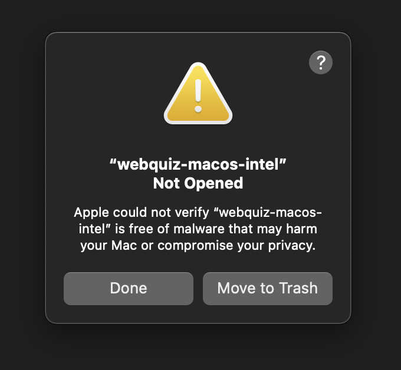
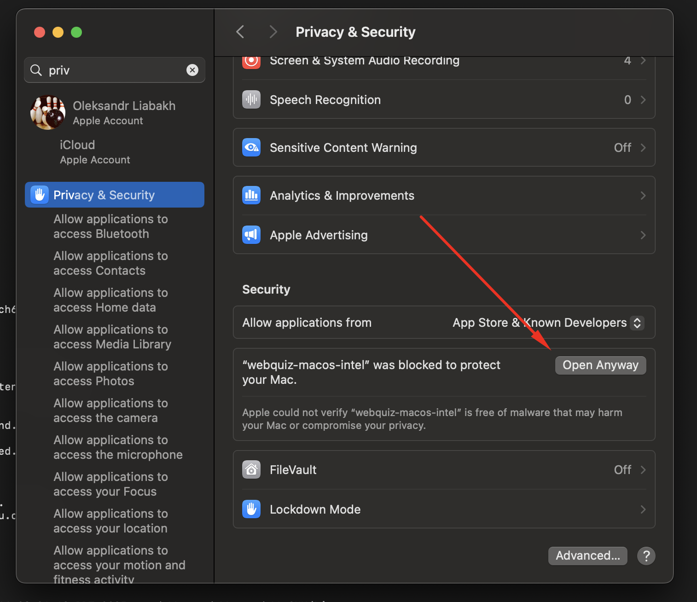
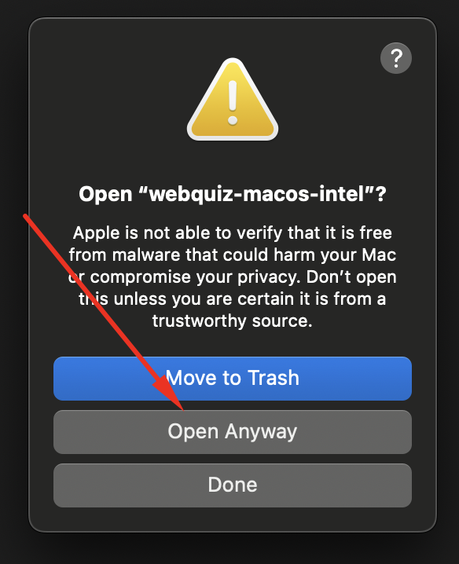
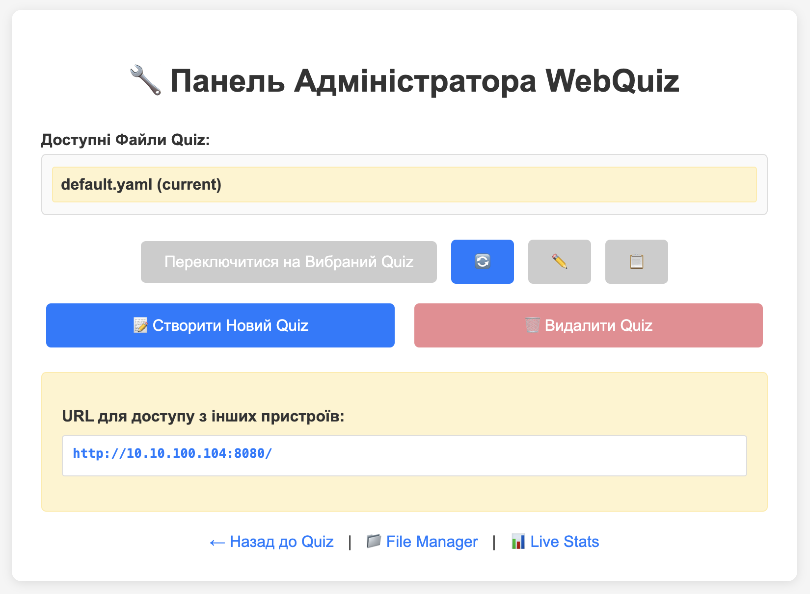
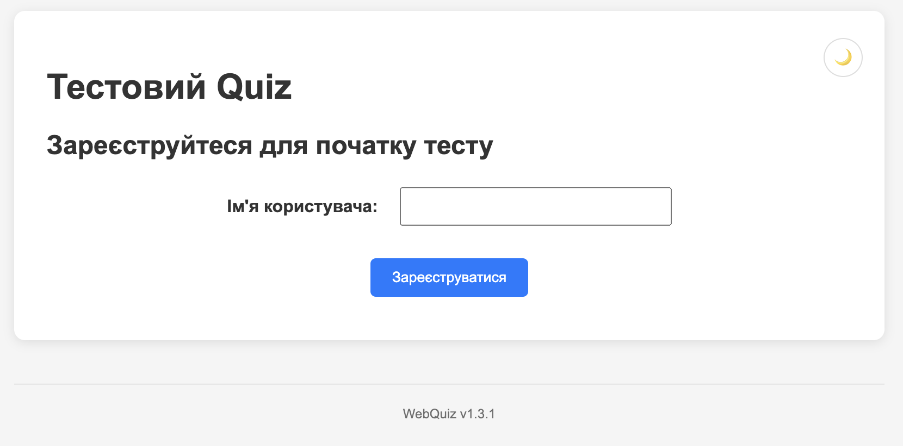

# Перший запуск

Цей розділ допоможе швидко запустити **WebQuiz** у локальній мережі.  
Система створена для роботи **всередині вашої мережі**, тому не варто відкривати порт у публічний інтернет. Це гарантує, що результати тестів залишаться приватними й доступними лише тим, хто підключений до локальної мережі.

---

## Завантаження та запуск

Найпростіший спосіб почати роботу з **WebQuiz** — це використати готовий бінарний файл.

1. Перейдіть на сторінку [Releases](https://github.com/oduvan/webquiz/releases) у GitHub-репозиторії проєкту.  
2. Завантажте бінарний файл, який відповідає вашій операційній системі (Windows, macOS або Linux).  
3. Якщо файл постачається у вигляді архіву, розпакуйте його у будь-яку зручну папку.  
4. Запустіть файл:
   - **Windows:** двічі клацніть на `webquiz.exe` або запустіть його з командного рядка.  
   - **macOS / Linux:** спочатку дозвольте виконання команди:
     ```
     chmod +x webquiz
     ```
     після чого запустіть:
     ```
     ./webquiz
     ```

### Важливо для macOS користувачів

При першому запуску на macOS ви побачите попередження безпеки, оскільки бінарний файл не підписаний Apple:



Щоб дозволити запуск:

1. Натисніть **Done** у попередженні
2. Відкрийте **System Settings** (Налаштування системи) → **Privacy & Security** (Конфіденційність та безпека)
3. Прокрутіть до розділу **Security** та натисніть **Open Anyway**:



4. Підтвердіть, натиснувши **Open Anyway** у діалозі:



Тепер WebQuiz запуститься нормально. Це одноразова процедура — наступні запуски не потребуватимуть підтвердження.

### Важливо для Windows користувачів

Windows Defender або інший антивірус може позначити бінарний файл як потенційну загрозу. **Це нормальна поведінка для програм, створених за допомогою PyInstaller** — це відома проблема хибних спрацювань ([детальніше на GitHub](https://github.com/pyinstaller/pyinstaller/issues/6754)).

Це **не вірус**. WebQuiz — це безпечне програмне забезпечення з відкритим вихідним кодом. Ви можете:
- Перевірити вихідний код на [GitHub](https://github.com/oduvan/webquiz)
- Додати файл до винятків Windows Defender
- Використати альтернативний спосіб установки через Python (`pip install webquiz`)

Якщо ви бачите попередження, дозвольте запуск програми або додайте її до списку довірених додатків у вашому антивірусі.

---

5. Після запуску у терміналі з'явиться відкриється сторіка адмін панелі [http://localhost:8080/admin/](http://localhost:8080/admin/):



---

## Створювані файли та папки

Після першого запуску у тій самій директорії, де знаходиться виконуваний файл, WebQuiz створить кілька службових файлів і папок. Вони потрібні для збереження налаштувань, результатів та діагностики:

| Файл / папка | Призначення |
|---------------|--------------|
| **config.yaml** | Головний конфігураційний файл. Зберігає параметри системи, включаючи налаштування реєстрації користувачів, формат тестів і загальні опції. |
| **quizzes/** | Папка для збереження тестів у форматі YAML. Ви можете створювати власні файли з питаннями або редагувати приклад, що додається за замовчуванням. |
| **results/** | Тут зберігатимуться результати тестування у форматі CSV. Їх можна переглядати або відкривати у табличних редакторах. |
| **logs/** | Папка з журналами роботи програми. У ній фіксуються повідомлення про запуски, помилки або попередження. Якщо під час тестування щось піде не так, саме ці файли допоможуть знайти причину. |
| **static/** | Містить веб-інтерфейс, який бачать користувачі. Зазвичай редагувати ці файли не потрібно. |

---

## Перший тест

Одразу після запуску WebQuiz автоматично створює приклад простого тесту.  
Він потрібен, щоб користувач міг одразу перевірити роботу системи без додаткових налаштувань.

Щоб пройти тест:

1. Відкрийте адресу [http://localhost:8080](http://localhost:8080) у браузері.



2. Уведіть своє ім’я (або будь-яке тестове ім’я, якщо ви просто перевіряєте роботу).  
3. Натисніть кнопку **Зареєструватися** — система завантажить приклад тесту з файлу конфігурації, і ви зможете пройти його як звичайний користувач.  
4. Після завершення тесту відкрийте папку **results** — там ви знайдете файл із результатами у форматі CSV. Якщо потрібно, перегляньте також журнали у папці **logs**, щоб переконатися, що сервер працює без помилок.


---

## Альтернативні способи запуску та конфігурації

Якщо ви хочете більш гнучко налаштовувати роботу WebQuiz або інтегрувати його у власні сценарії, доступні додаткові методи запуску:

- **Запуск через Python:**
  ```
  pip install webquiz
  python -m webquiz
  ```

- **Запуск через Poetry (для розробників):**
  ```
  git clone https://github.com/oduvan/webquiz.git
  cd webquiz
  poetry install
  webquiz
  ```

- **Додаткові параметри командного рядка:**
  - `--config` — вказує шлях до власного конфігураційного файлу.  
  - `--csv-file` — задає інше місце для збереження результатів.  
  - `--log-file` — змінює шлях до файлу журналів.  
  - `-d` або `--daemon` — запуск у фоновому режимі.  
  - `--stop`, `--status` — зупинка або перевірка стану сервера.

Ці можливості стануть у пригоді, якщо ви хочете використовувати WebQuiz як частину більшої системи або запускати його автоматично при старті пристрою.
