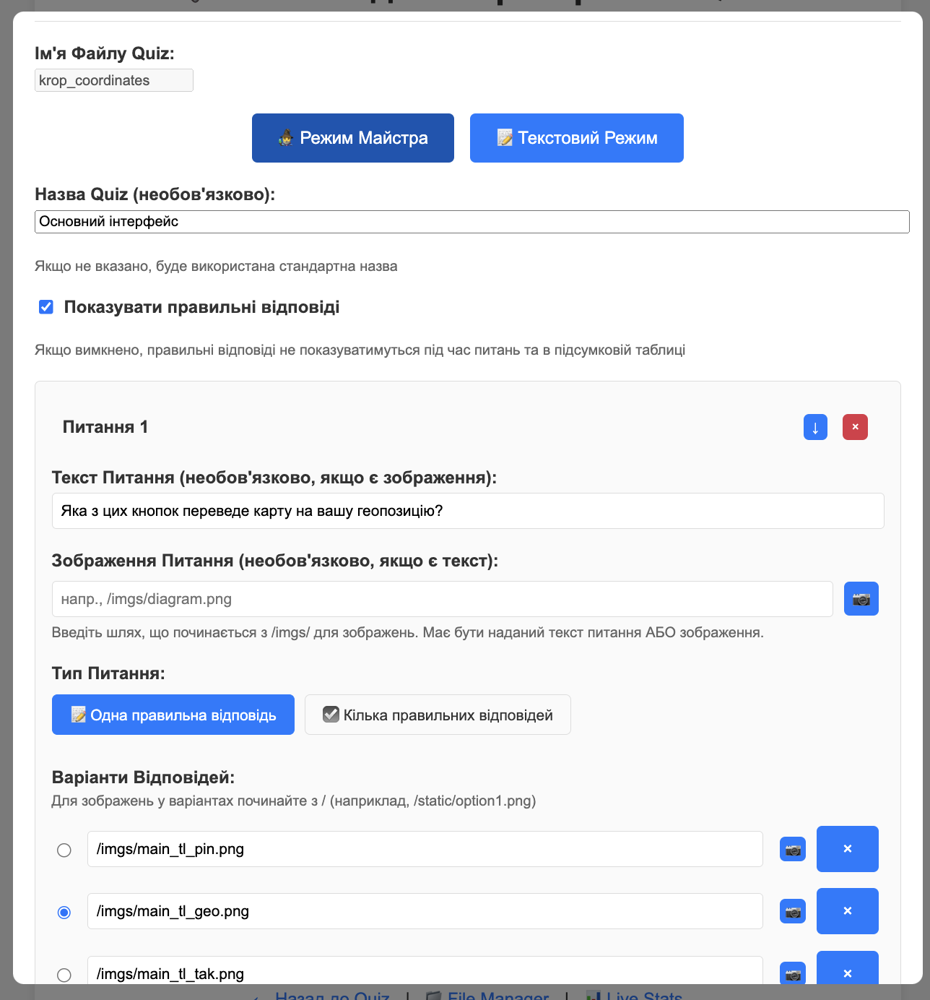

## Адміністративний інтерфейс WebQuiz

Адміністративний інтерфейс **WebQuiz** дозволяє керувати тестами, переглядати результати, схвалювати заявки користувачів і працювати з файлами безпосередньо через браузер.
Доступ до панелі відкривається автоматично, якщо ви заходите з локальної адреси (`127.0.0.1` або `localhost`), або за допомогою **Master Key**, якщо підключення відбувається з іншого пристрою в мережі.

---

### Головна панель адміністратора

На головній сторінці адміністративної панелі розміщені основні інструменти для керування тестами, підтвердження користувачів і завантаження додаткових наборів запитань.

#### Основні елементи панелі

- **Доступні файли Quiz**
  У верхній частині сторінки відображається список усіх тестів, наявних у папці `quizzes`.
  Кожен тест показує назву файлу та заголовок (якщо встановлено), наприклад: `default.yaml - Мій Тест`.
  Поточний активний тест виділено жовтим фоном і позначено як **(поточний)**.

  Ви можете вибрати кілька тестів за допомогою **Ctrl+клік** (або **Cmd+клік** на macOS) для індивідуального вибору, або **Shift+клік** для вибору діапазону. Коли вибрано кілька тестів, їх можна об'єднати в один або видалити разом.

  Ви можете перемикатися між тестами або створювати нові.

- **Кнопка “Створити Новий Quiz”**
  Відкриває інтерфейс створення нового тесту у візуальному режимі.
  Новий файл буде додано у директорію `quizzes`.

- **Кнопка “Видалити Quiz”**
  Дозволяє видалити вибраний тест із файлової системи.

- **Очікуючі підтвердження**
  Ця панель з'являється, якщо в конфігурації увімкнено ручне схвалення користувачів (`registration.approve: true`, детальніше див. [Конфігурація](040_config.md)).
  Тут відображається список користувачів, які зареєструвалися та очікують на схвалення для початку тесту.
  Для кожного користувача показано ім'я та час реєстрації. Натисніть кнопку **"Підтвердити"**, щоб дозволити їм розпочати.
  Таймер тесту запускається лише після схвалення, що забезпечує чесний відлік часу для всіх учасників.

- **Управління Відповідями**
  Цей розділ відображається лише для тестів з увімкненим `show_answers_on_completion: true` (детальніше про цю опцію див. у розділі "Формат файлу тесту").

  Дозволяє адміністратору примусово відкрити правильні відповіді для всіх учнів, не чекаючи поки всі завершать тестування.

  **Коли це корисно:**
  - Більшість учнів завершили тест, але 2-3 учні затримуються
  - Ви не хочете чекати на відстаючих і готові показати відповіді всім

  **Як це працює:**
  1. Натисніть кнопку **"Відкрити Відповіді для Всіх"**
  2. Підтвердіть дію у діалоговому вікні
  3. Усі учні (включно з тими, хто ще не завершив) побачать правильні відповіді після завершення тесту
  4. Нові учні, які зареєструються пізніше, також побачать відповіді

  > ⚠️ **Важливо:** Це одностороння дія — відмінити її можна лише перезапустивши quiz або перемкнувшись на інший тест.

- **Доступні Quiz для завантаження**
  Цей розділ з'являється лише якщо налаштовано секцію `quizzes` у `webquiz.yaml` (детальніше див. [Конфігурація](040_config.md)).
  Тут показуються тести, доступні для завантаження із зовнішніх джерел (наприклад, репозиторіїв GitHub).
  Кнопка **"Завантажити"** автоматично завантажує архів і розпаковує його у папку `quizzes`.

- **URL для доступу з інших пристроїв**
  У нижній частині панелі відображаються посилання, за якими інші учасники можуть підключитися до тесту.
  Це включає адресу локальної мережі (наприклад, `http://192.168.1.100:8080/`).
  Коли підключено SSH-тунель, також відображається зовнішній URL із зеленим фоном.

- **SSH Tunnel**
  Цей розділ з'являється лише якщо налаштовано секцію `tunnel` у `webquiz.yaml` (детальніше див. [Конфігурація](040_config.md)).
  Він дозволяє відкрити ваш локальний сервер тестів в інтернет через SSH зворотний тунель.
  - **Server** — відображає ім'я хоста тунельного сервера
  - **Public Key** — ваш публічний SSH-ключ, який потрібно зареєструвати на тунельному сервері. Використовуйте кнопку **Copy** для копіювання в буфер обміну.
  - **Connect/Disconnect** — натисніть для встановлення або розриву з'єднання тунелю

  При підключенні публічний URL з'являється у розділі "URL для доступу з інших пристроїв" із зеленим фоном, що дозволяє учасникам поза локальною мережею приєднатися до тесту.

- **Перемикач теми**
  У правому верхньому куті сторінки є кнопка для перемикання між світлою та темною темами. Налаштування зберігається у браузері та застосовується до всіх сторінок WebQuiz.

---

### Менеджер файлів (File Manager)

Менеджер файлів відкривається посиланням **File Manager** у нижній частині адмін-панелі.
Він дозволяє швидко переглядати, завантажувати, редагувати та діагностувати створені сервером файли.

У верхній частині сторінки є **поле пошуку** для фільтрації файлів за назвою та кнопка **Refresh** для оновлення списку файлів.

#### Основні вкладки

- **CSV Files** — список файлів результатів тестів.
  Кожен елемент показує назву файлу, розмір і дату останньої модифікації.
  Для кожного файлу доступні три кнопки:
  - **Text** — переглянути необроблений вміст CSV у браузері
  - **Table** — переглянути дані у форматованій таблиці (див. нижче)
  - **Download** — зберегти файл локально

- **Log Files** — журнали запусків сервера.
  Корисно для пошуку технічних помилок або перевірки, як працював сервер у попередніх сесіях.

- **Quiz Files** — список YAML-файлів тестів із папки `quizzes`.
  Ви можете переглядати та редагувати файли тестів безпосередньо. При редагуванні кнопка **Validate** перевіряє синтаксис YAML перед збереженням.

- **Config** — файл конфігурації сервера (`webquiz.yaml`).
  Ви можете редагувати конфігурацію безпосередньо у браузері з підсвічуванням синтаксису.

#### Табличний перегляд

Коли ви натискаєте кнопку **Table** для CSV-файлу, відкривається модальне вікно з даними у форматованій таблиці. Таблиця показує стовпці:
- **user_id** — ідентифікатор учасника
- **question** — текст питання
- **selected_answer** — відповідь, вибрана учасником
- **correct_answer** — правильна відповідь
- **is_correct** — чи була відповідь правильною (True/False)
- **time_taken** — час, витрачений на питання в секундах

Цей перегляд дозволяє легко аналізувати результати тестів без завантаження файлу.

#### Вкладка Config

Вкладка **Config** відображає файл конфігурації сервера в YAML-редакторі. Ви можете:
- Переглядати та редагувати всі налаштування конфігурації
- Натиснути **Save Configuration** для збереження змін
- Зміни перевіряються перед збереженням, і автоматично створюється резервна копія

У нижній частині сторінки є посилання для швидкої навігації: **Back to Admin Panel**, **Quiz Home** та **Live Stats**.

---

### Редактор Quiz

Редактор Quiz дозволяє створювати або змінювати запитання у вибраному тесті.
Редактор використовує візуальний інтерфейс майстра для зручного керування питаннями.

#### Налаштування Quiz

- **Ім'я файлу Quiz**
  Назва файлу для тесту (без розширення `.yaml`).

- **Назва Quiz (необов'язково)**
  Зрозуміла назва для тесту. Якщо не вказано, використовується назва файлу.

- **Показувати правильні відповіді**
  Якщо ввімкнено, учасники бачать правильні відповіді під час тестування та в підсумковій таблиці.

- **Рандомізувати порядок питань**
  Якщо ввімкнено, питання перемішуються для кожного учасника. Кожен студент бачить питання у різному випадковому порядку.

#### Редактор питань

Для кожного питання можна налаштувати:

- **Текст питання** — питання, яке потрібно поставити (обов'язково, якщо немає зображення)

- **Зображення питання** — шлях до файлу зображення (наприклад, `/imgs/diagram.png`). Натисніть іконку папки для перегляду доступних зображень. Зображення зберігаються у папці `quizzes/imgs/`.

- **Файл для завантаження** — прикріпіть файл, який учасники можуть завантажити при відповіді на питання (наприклад, `data.xlsx`). Натисніть іконку скріпки для перегляду доступних файлів. Файли зберігаються у папці `quizzes/attach/`.

- **Тип питання** — доступні три типи:
  - **Одна правильна відповідь** — учасники вибирають один варіант зі списку
  - **Кілька правильних відповідей** — учасники можуть вибрати кілька варіантів
  - **Текстова відповідь** — учасники вводять відповідь у текстове поле (перевіряється за допомогою коду перевірки). *Ця функція наразі в бета-тестуванні.*

- **Варіанти відповідей** — для питань з одним/кількома варіантами додайте варіанти відповідей. Кожен варіант може бути текстом або шляхом до зображення. Позначте правильну відповідь(і) радіокнопкою або прапорцем.

- **Бали за питання** — кількість балів за правильну відповідь (за замовчуванням: 1). Питання з більш ніж 1 балом показують індикатор трофею.

- **Прив'язати до попереднього питання** — коли ввімкнено рандомізацію, це зберігає питання поруч з попереднім. Корисно для групування пов'язаних питань разом.

Питання можна переставляти, перетягуючи ручку зліва, та згортати/розгортати натисканням на стрілку.

#### Збереження

- **Зберегти Quiz** — зберегти тест і закрити редактор
- **Зберегти і Продовжити** — зберегти тест і продовжити редагування
- **Скасувати** — відхилити зміни і закрити редактор

---

### Жива статистика

Сторінка живої статистики забезпечує моніторинг прогресу тестування всіх учасників у реальному часі. Доступ до неї здійснюється через посилання **Live Stats** у нижній частині будь-якої адмін-сторінки.

#### Кнопки фільтрації

У верхній частині сторінки кнопки фільтрації дозволяють переглядати:
- **All** — всіх зареєстрованих учасників
- **In Progress** — учасників, які зараз проходять тест
- **Completed** — учасників, які завершили тест

Кожна кнопка показує кількість учасників у цій категорії.

#### Сітка статистики

Основна область відображає сітку з:
- **Стовпець користувачів** — імена учасників та їх ідентифікатори
- **Стовпці питань** — текст кожного питання (скорочений для відображення)

#### Кольорове кодування

Кожна клітинка показує статус відповіді учасника:
- **Червоне коло** — неправильна відповідь
- **Зелений фон** — правильна відповідь
- **Жовтий фон** — зараз відповідає на це питання
- **Порожня/біла** — ще не відповів

Кожна відповідана клітинка також відображає час, витрачений на відповідь на це питання.

Цей перегляд дозволяє моніторити прогрес тестування в реальному часі та виявляти учасників, які можуть мати труднощі або потребують допомоги.

---

### Швидкий доступ

У нижній частині кожної сторінки адмін-інтерфейсу є зручні посилання:
- **← Назад до Quiz** — повернення на головну сторінку тесту.
- **Quiz Home** — перехід до інтерфейсу учасника.
- **Live Stats** — сторінка з живою статистикою (кількість користувачів, стан тестів, активні сесії).

---

### Перевірка версії пакета

Адміністративна панель автоматично перевіряє, чи не було оновлено пакет WebQuiz під час роботи сервера.
Якщо виявлено нову версію (наприклад, після оновлення через `pip install --upgrade webquiz`), у нижній частині панелі з'явиться сповіщення:

- **"New version installed (vX.Y)" + "Restart Required"** — означає, що встановлено нову версію пакета, але сервер ще працює на старій версії.

Для застосування оновлення необхідно перезапустити сервер WebQuiz.

---

Ця панель забезпечує повний цикл керування **WebQuiz** — від створення тестів і підтвердження користувачів до моніторингу результатів і завантаження звітів.
Вона створена для локальної роботи, тому вся інформація залишається у вашій мережі без передавання в інтернет.
