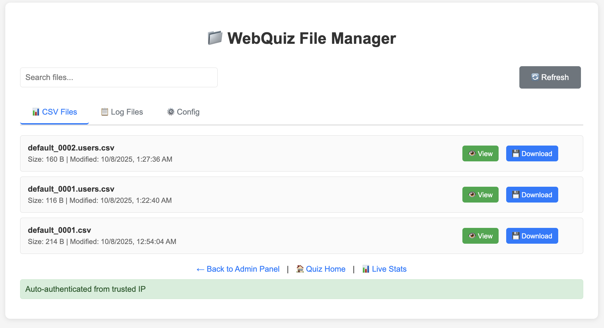

## Адміністративний інтерфейс WebQuiz

Адміністративний інтерфейс **WebQuiz** дозволяє керувати тестами, переглядати результати, схвалювати заявки користувачів і працювати з файлами безпосередньо через браузер.
Доступ до панелі відкривається автоматично, якщо ви заходите з локальної адреси (`127.0.0.1` або `localhost`), або за допомогою **Master Key**, якщо підключення відбувається з іншого пристрою в мережі.

---

### Головна панель адміністратора

На головній сторінці адміністративної панелі розміщені основні інструменти для керування тестами, підтвердження користувачів і завантаження додаткових наборів запитань.

#### Основні елементи панелі

- **Доступні файли Quiz**
  У верхній частині сторінки відображається список усіх тестів, наявних у папці `quizzes`.
  Поточний активний тест позначено як **(current)**.
  Ви можете перемикатися між тестами або створювати нові.

- **Кнопка “Створити Новий Quiz”**
  Відкриває інтерфейс створення нового тесту у візуальному режимі.
  Новий файл буде додано у директорію `quizzes`.

- **Кнопка “Видалити Quiz”**
  Дозволяє видалити вибраний тест із файлової системи.

- **Очікуючі підтвердження**
  Цей блок з'являється, якщо в конфігурації (`registration.approve: true`) увімкнено ручне схвалення користувачів.
  Тут відображаються заявки користувачів, які пройшли реєстрацію, але ще не допущені до тестування.
  Кожного можна схвалити кнопкою **"Підтвердити"**.

- **Управління Відповідями**
  Цей розділ відображається лише для тестів з увімкненим `show_answers_on_completion: true` (детальніше про цю опцію див. у розділі "Формат файлу тесту").

  Дозволяє адміністратору примусово відкрити правильні відповіді для всіх учнів, не чекаючи поки всі завершать тестування.

  **Коли це корисно:**
  - Більшість учнів завершили тест, але 2-3 учні затримуються
  - Ви не хочете чекати на відстаючих і готові показати відповіді всім

  **Як це працює:**
  1. Натисніть кнопку **"Відкрити Відповіді для Всіх"**
  2. Підтвердіть дію у діалоговому вікні
  3. Усі учні (включно з тими, хто ще не завершив) побачать правильні відповіді після завершення тесту
  4. Нові учні, які зареєструються пізніше, також побачать відповіді

  > ⚠️ **Важливо:** Це одностороння дія — відмінити її можна лише перезапустивши quiz або перемкнувшись на інший тест.

- **Доступні Quiz для завантаження**
  Якщо у конфігурації визначено розділ `quizzes` з посиланнями (`download_path`), тут показуються доступні тести, які можна завантажити з зовнішніх джерел.
  Кнопка **“Завантажити”** автоматично зберігає архів і розпаковує його у вказану папку.

- **URL для доступу з інших пристроїв**
  У нижній частині панелі відображається посилання, за яким інші учасники у локальній мережі можуть підключитися до тесту.
  Приклад: `http://10.10.100.104:8080/`.

---

### Менеджер файлів (File Manager)

Менеджер файлів відкривається посиланням **File Manager** у нижній частині адмін-панелі.
Він дозволяє швидко переглядати, завантажувати та діагностувати створені сервером файли.

#### Основні вкладки

- **CSV Files** — список файлів результатів тестів.
  Кожен елемент показує назву файлу, розмір і дату останньої модифікації.
  Можна натиснути **View**, щоб переглянути вміст безпосередньо у браузері, або **Download**, щоб зберегти файл локально.

- **Log Files** — журнали запусків сервера.
  Корисно для пошуку технічних помилок або перевірки, як працював сервер у попередніх сесіях.

- **Config** — поточний файл конфігурації `server_config.yaml` або `webquiz.yaml`, який можна переглянути прямо в інтерфейсі.

У нижній частині сторінки показано статус авторизації адміністратора.
Якщо ви підключені з локальної адреси або «довіреного IP», система автоматично виконує автентифікацію.

---

### Редактор Quiz

Редактор Quiz дозволяє створювати або змінювати запитання у вибраному тесті.
Доступний у двох режимах: **Майстра** (візуальний редактор) і **Текстовому** (робота безпосередньо з YAML-кодом).

#### Основні можливості редактора

- **Назва Quiz**
  Може бути задана у полі “Назва Quiz (необов’язково)”. Якщо не вказано, система використовує стандартну назву файлу.

- **Показ правильних відповідей**
  Якщо опція ввімкнена, учасник бачить правильні відповіді під час проходження тесту та в підсумковій таблиці.

- **Питання**
  Для кожного питання можна вказати:
  - текст питання;
  - шлях до зображення (наприклад, `/imgs/diagram.png`);
  - тип питання — **одна правильна відповідь** або **кілька правильних**;
  - список варіантів відповіді (текст або зображення).

  Якщо варіанти — це зображення, шляхи до них починаються з `/imgs/` або `/static/`.

- **Режими редагування**
  - **Режим Майстра** — зручний для візуального заповнення полів і створення нових питань.
  - **Текстовий режим** — відкриває вихідний YAML-файл для ручного редагування структури тесту.

---

### Швидкий доступ

У нижній частині кожної сторінки адмін-інтерфейсу є зручні посилання:
- **← Назад до Quiz** — повернення на головну сторінку тесту.
- **Quiz Home** — перехід до інтерфейсу учасника.
- **Live Stats** — сторінка з живою статистикою (кількість користувачів, стан тестів, активні сесії).

---

### Перевірка версії пакета

Адміністративна панель автоматично перевіряє, чи не було оновлено пакет WebQuiz під час роботи сервера.
Якщо виявлено нову версію (наприклад, після оновлення через `pip install --upgrade webquiz`), у нижній частині панелі з'явиться сповіщення:

- **"New version installed (vX.Y)" + "Restart Required"** — означає, що встановлено нову версію пакета, але сервер ще працює на старій версії.

Для застосування оновлення необхідно перезапустити сервер WebQuiz.

---

Ця панель забезпечує повний цикл керування **WebQuiz** — від створення тестів і підтвердження користувачів до моніторингу результатів і завантаження звітів.
Вона створена для локальної роботи, тому вся інформація залишається у вашій мережі без передавання в інтернет.
